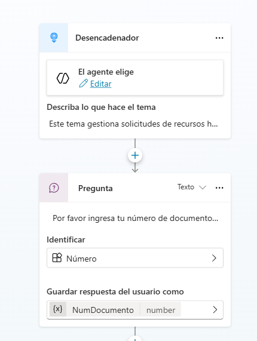
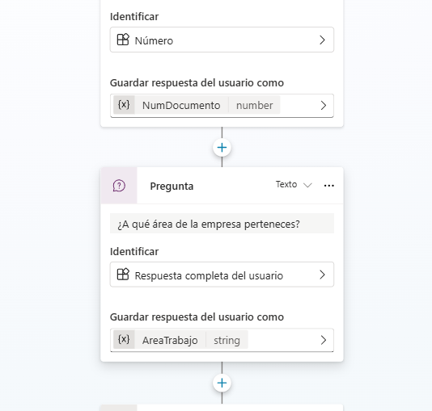
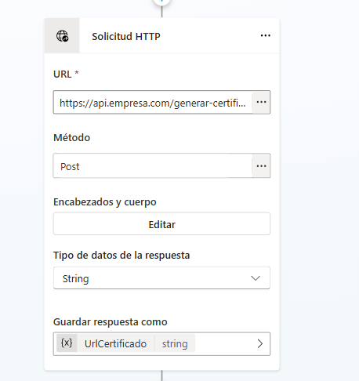
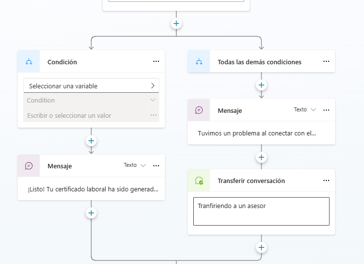
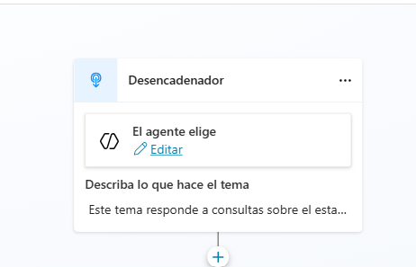
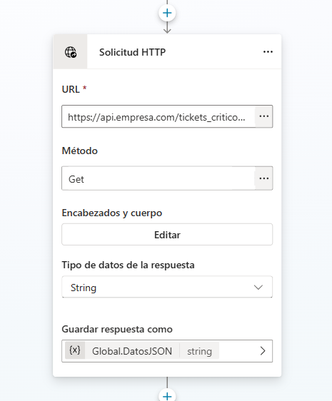
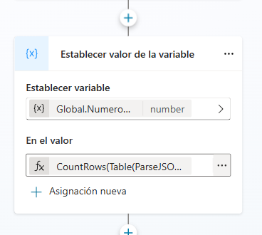
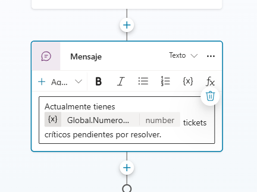
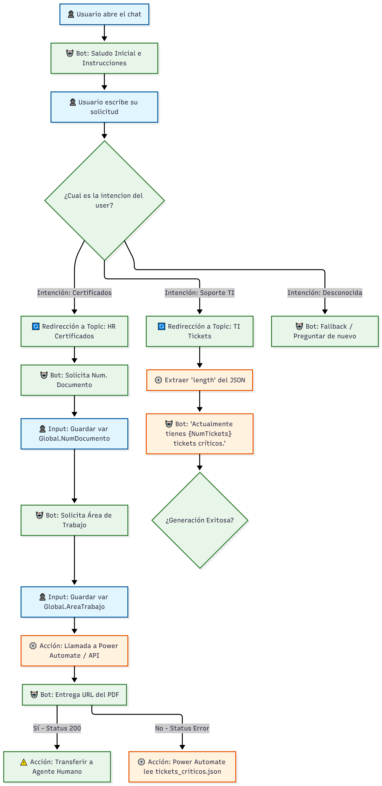

# Prueba Técnica: Orquestación de Agentes y Automatización

Este repositorio contiene la solución a la prueba técnica para el rol de Analista de Inteligencia Artificial.

## Reto 1: Lógica y Orquestación de Agentes (Recursos Humanos)
A continuación se presenta la arquitectura del agente conversacional diseñado en Microsoft Copilot Studio para atender la solicitud de certificados laborales.

### 1. Desencadenador (Reconocimiento de Intención)
El agente utiliza un modelo generativo entrenado con frases clave para enrutar la solicitud del usuario correctamente.

### 2. Extracción de Entidades y Validación
Se solicitan dos datos clave (Número de documento y Área). El sistema valida que el documento contenga únicamente caracteres numéricos.

### 3. Llamada a Acción Externa (API Rest)
El agente consume una API a través de una solicitud HTTP POST, enviando los datos recolectados de forma segura en el cuerpo de la petición.

### 4. Manejo de Errores y Respuesta Final (Fallback)
Se evalúa la respuesta del servidor. Si es exitosa, se entrega el PDF; si falla, se realiza una transferencia (handoff) a un agente humano.

## Reto 2 ___________________________________________
## Reto 2: Scripting de Automatización (Python) y Agente TI

### Script de Python
El script `filtro_tickets.py` automatiza la lectura y filtrado de tickets críticos (Estado: "Pendiente", Prioridad: "Alta") desde un archivo `.txt` delimitado por punto y coma (`;`).

**Cómo ejecutar:**
1. Asegúrate de tener Python instalado.
2. Coloca tu archivo `tickets.txt` en la misma carpeta.
3. Ejecuta en terminal: `python filtro_tickets.py`
4. El sistema generará automáticamente `tickets_criticos.json`.

### Arquitectura del Agente de Soporte TI
El agente consulta de forma automatizada el JSON generado para informar al usuario sobre su carga de trabajo crítica.

### 1. Desencadenador (Consultas sobre el estado de los tickets de soporte de TI.)

### Llamado a la accion solicitud HTTP

### Conteo de tickets críticos

### Respuesta final

## Reto 3______

Para el enrutamiento inteligente, se ha adoptado un enfoque de Clasificación de Intenciones (Intent Classification) mediante el uso de Frases Desencadenantes en cada módulo especializado.

Capa de Orquestación: El tema 'Saludo' captura la intención general del usuario.

Capa de Enrutamiento: El motor de IA de Copilot Studio procesa la entrada del usuario y, comparándola contra las frases configuradas en los temas 'Reto 1' y 'Reto 2', realiza un enrutamiento dinámico automático.

Ventaja: Este permite que el bot entienda variaciones del lenguaje natural (NLP) sin necesidad de programar manualmente cada posible forma de pedir un certificado.